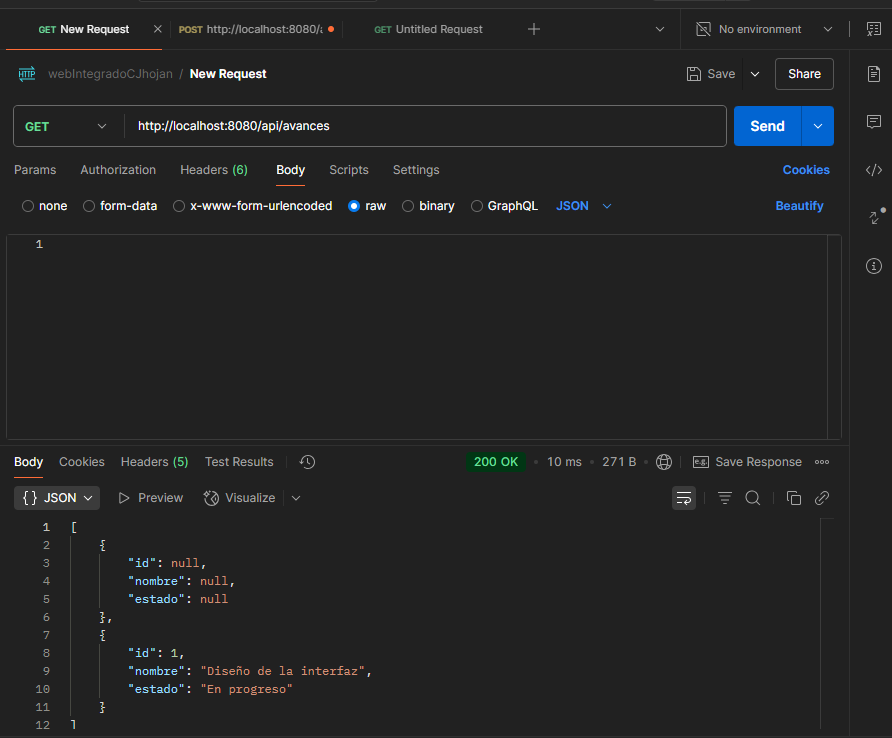
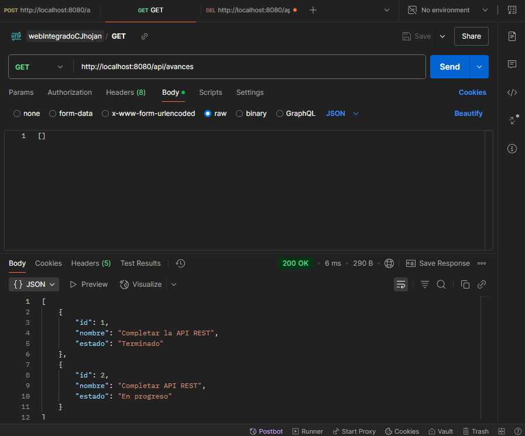
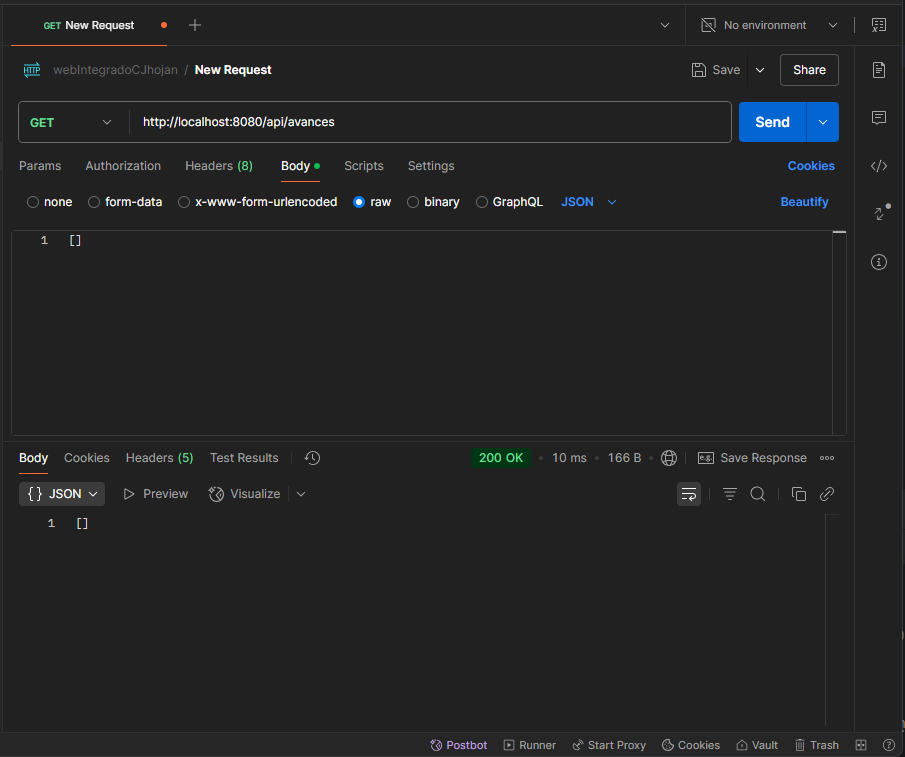
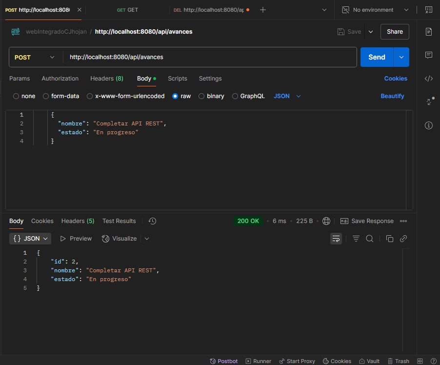
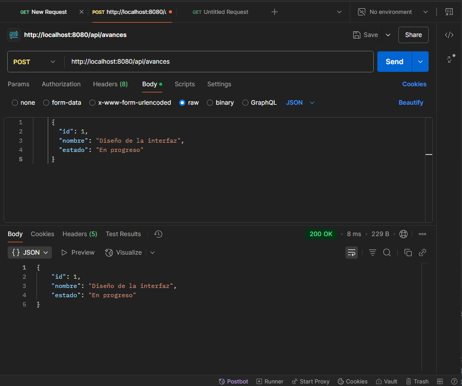
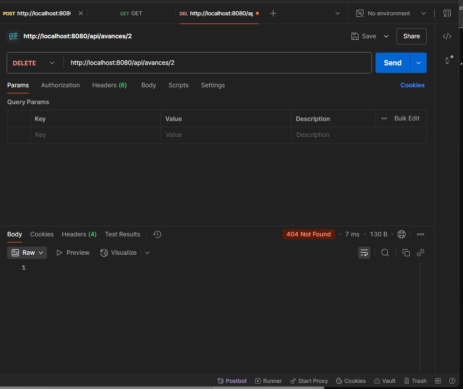

# Proyecto de Avance

## Descripción
Este proyecto gestiona los avances de un proyecto. Los avances pueden ser creados, actualizados, obtenidos y eliminados.

## Estructura del Proyecto
- **`/controller`**: Contiene los controladores REST para gestionar las solicitudes HTTP.
- **`/service`**: Contiene la lógica de negocio para crear, actualizar, eliminar y obtener avances.
- **`/model`**: Contiene la clase `Avance`, que representa un avance de proyecto.

## Instrucciones para ejecutar el proyecto
1. Clona el repositorio.
2. Ejecuta el proyecto con `mvn spring-boot:run`.
3. La API estará disponible en `http://localhost:8080/api/avances`.

## Pruebas de API en Postman

### 1. Prueba GET (Obtener todos los avances)

### 2. Prueba POST (Crear un nuevo avance)

### 3. Prueba PUT (Actualizar un avance)

### 4. Prueba DELETE (Eliminar un avance)

